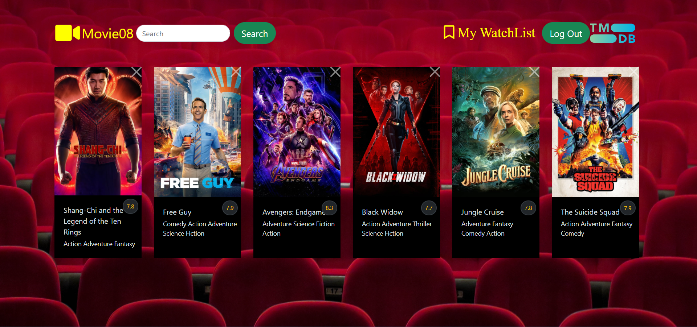

# Movie08

[movie08.netlify.app](https://movie08.netlify.app/popular)  
It's a movie app,building with react and bootstrap.

Users can:

- to filter and search for movie ;
- to view movie details;
- create User Account to build own watch lists and write comments.
  
  

## API Reference

P.S. If you want to backend side,just clone [movie08](https://github.com/smikayilov08/movie08)
